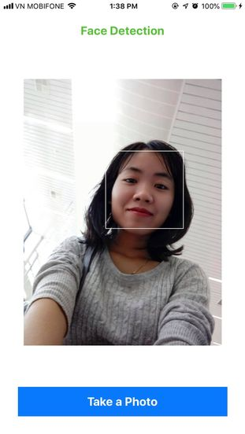

# Face detection with OpenCV, Core Image, and Vision

* Create date: 2018-10-30

## Getting started

One of the most important processes involved in Face Recognition is how accurately you detect faces located in any scene. This is why it is really important to decide what framework should we use for Face detection when we are planning to create an iOS app.

In this tutorial, we tried to compare performance of the most popular frameworks (OpenCV, Core Image, and Vision) used in iOS for Face detection.

## [OpenCV](https://opencv.org/about.html)

OpenCV is an open source Computer Vision and Machine Learning library. In general, OpenCV is an infrastructure for object detection that can be trained to detect any objects, including faces. Its toolkit contains thousands of optimized algorithms to serve various purposes.

Here are three ways to add OpenCV to your own iOS project:

* Using CocoaPods:

```bash
pod "OpenCV"
```

* Get and add an official iOS framework release to your project

* Using sources from [GitHub](https://github.com/opencv/opencv) and follow the [instruction](https://docs.opencv.org/2.4/doc/tutorials/introduction/ios_install/ios_install.html#ios-installation) to build your own library


## [Core Image](https://developer.apple.com/)

Core Image is an image processing and analysis technology that provides high-performance processing for still and video images. Use the many built-in image filters to process images and build complex effects by chaining filters.

It operates on image data types from the Core Graphics, Core Video, and Image I/O frameworks, using either a GPU or CPU rendering path. For details, see [here](https://developer.apple.com/documentation/coreimage).


## [Vision](https://machinelearning.apple.com)

Apply high-performance image analysis and computer vision techniques to identify faces, detect features, and classify scenes in images and video.

## Face detection with OpenCV

Since OpenCV is built on C++ you can't call its functions directly from Swift.


Credit: [iOS -- OpenCV and Swift](https://medium.com/@borisohayon/ios-opencv-and-swift-1ee3e3a5735b)

OpenCV uses Haar Cascade Classifier to detect face from `MAT Image` by locating the Haar Cascade for frontal face. To detect faces using OpenCV, you need to follow the below steps:

* Create the Haar Cascade classifier by loading the `haarcascade_frontalface_alt2.xml` file.

```objective-c
    cv::CascadeClassifier classifier;
    const NSString* cascadePath = [[NSBundle mainBundle] pathForResource:@"haarcascade_frontalface_alt2" ofType:@"xml"];
    classifier.load([cascadePath UTF8String]);
```

* Initialize variables for classifier

```objective-c
    std::vector<cv::Rect> detections;
    
    const double scalingFactor = 1.1;
    const int minNeightbors = 2;
    const int flags = 0;
    const cv::Size minimumSize(300, 300);
```

* At the end, you need to call `detectMultiScale` function of Cascade classifier which will return the detected faces from the given image.

```objective-c
    classifier.detectMultiScale(grayMat, detections, scalingFactor, minNeightbors, flags, minimumSize);
```

The complete code you can find [here](https://github.com/sthanhng/OpenCV-iOS/tree/master/Face-Detection/FaceDetection).

## Examples

 

## Face detection using Core Image

* You can find more details **Face detection using Core Image** [here](https://github.com/sthanhng/OpenCV-iOS/tree/master/Face-Detection/FaceDetectionCoreImage).

## References

* [iOS — OpenCV and Swift](https://medium.com/@borisohayon/ios-opencv-and-swift-1ee3e3a5735b)
* [OpenCV with Swift - step by step](https://medium.com/@yiweini/opencv-with-swift-step-by-step-c3cc1d1ee5f1)
* [OpenCV iOS](https://docs.opencv.org/3.4/d3/dc9/tutorial_table_of_content_ios.html)
